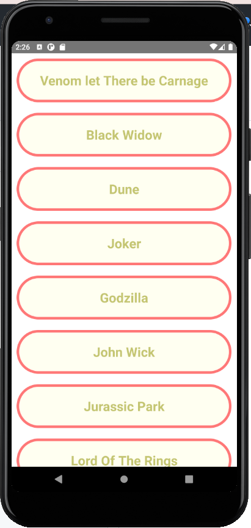

<meta charset="UTF-8">

  

    <h1>Tugas Mobile</h1>
  

  

  
  
  
  
  

<ul>
  <li>Home Screen</li>
  <li>Games Screen</li>
  <li>Movies Screen</li>
  <li>Contents List Screen</li>
</ul>
  

I will display &#65; &#66; &#67;

 ❎
